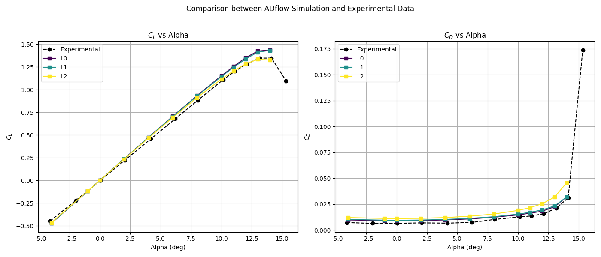
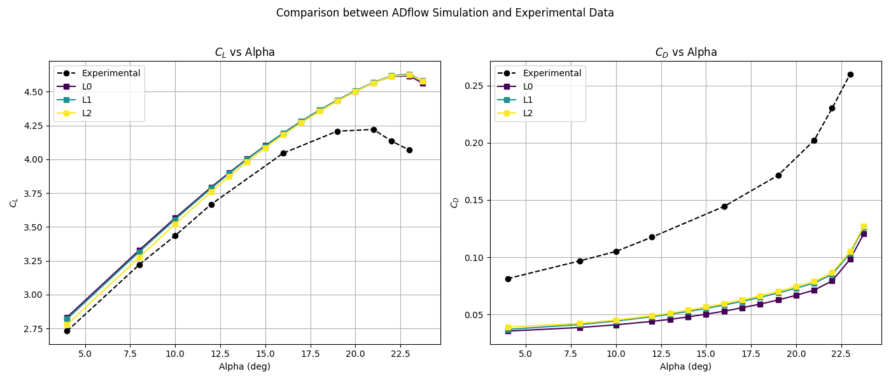
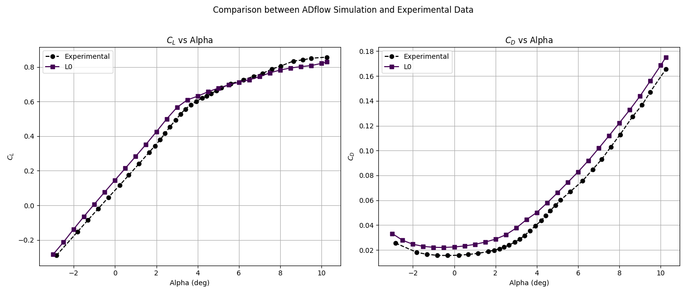

Test Cases and Expected Results
===============================

An `example hierarchy <introduction.md#example-hierarchy>`__ is provided
in the `Introduction <introduction.md>`__. This hierarchy serves as a
reference for understanding the structure and workflow.

When the supplied `grid files <usage.md#grid-files>`__ and `experimental
data <usage.md#experimental-data>`__ are used, the expected results for
this hierarchy are outlined on this page.

Hierarchy: 2D Clean
-------------------

Case: NACA 0012
~~~~~~~~~~~~~~~

**Geomerty Info:**

.. code:: yaml

   areaRef: 1.0
   chordRef: 1.0

**Aero Options:**

.. code:: yaml

   useANKSolver: true
   nSubiterTurb: 20
   useNKSolver: false
   NKSwitchTol: 1.0e-06
   ANKCoupledSwitchTol: 0.001
   ANKSecondOrdSwitchTol: 1.0e-12
   L2Convergence: 1.0e-08
   nCycles: 150000
   liftIndex: 2

Scenario: 1
^^^^^^^^^^^

**Scenario Info:**

.. code:: yaml

   Re: 3900000.0
   mach: 0.3
   Temp: 298.0

   **NACA 0012 (Scenario: 1) Results**

Hierarchy: 2D High-Lift
-----------------------

Case: Mc Donnell Dolugas 30P-30N
~~~~~~~~~~~~~~~~~~~~~~~~~~~~~~~~

**Geomerty Info:**

.. code:: yaml

   areaRef: 1.0
   chordRef: 1.0

**Aero Options:**

.. code:: yaml

   useANKSolver: true
   nSubiterTurb: 20
   useNKSolver: false
   NKSwitchTol: 0.0001
   ANKCoupledSwitchTol: 1.0e-07
   ANKSecondOrdSwitchTol: 1.0e-05
   L2Convergence: 1.0e-10
   nCycles: 150000
   liftIndex: 2
   nearWallDist: 0.01

.. _scenario-1-1:

Scenario: 1
^^^^^^^^^^^

**Scenario Info:**

.. code:: yaml

   Re: 9000000.0
   mach: 0.2
   Temp: 298.0

   **30P-30N (Scenario: 1) Results**

Hierarchy: 3D Clean
-------------------

Case: NASA Common Research Model, Clean Configuration
~~~~~~~~~~~~~~~~~~~~~~~~~~~~~~~~~~~~~~~~~~~~~~~~~~~~~

**Geomerty Info:**

.. code:: yaml

   areaRef: 191.845
   chordRef: 7.00532

**Aero Options:**

.. code:: yaml

   useZipperMesh: True
   useANKSolver: True
   nSubiterTurb: 5
   useNKSolver: False
   ANKCoupledSwitchTol: 1e-7
   ANKSecondOrdSwitchTol: 1e-6
   L2Convergence: 1e-10
   nCycles: 150000
   liftIndex: 3

.. _scenario-1-2:

Scenario: 1
^^^^^^^^^^^

**Scenario Info:**

.. code:: yaml

   Re: 5000000.0
   mach: 0.85
   Temp: 322.039

   **CRM Clean (Scenario: 1) Results**

Scenario: 2
^^^^^^^^^^^

**Scenario Info:**

.. code:: yaml

   Re: 5000000.0
   mach: 0.70
   Temp: 299.817

.. figure:: test_cases/crm_clean_m07.png
   :alt: CRM Clean (Scenario: 2)
   :width: 800px
   :align: center

   **CRM Clean (Scenario: 2) Results**

Hierarchy: Aerostructural
-------------------------

Case: Mach Aero Wing
~~~~~~~~~~~~~~~~~~~~

**Geomerty Info:**

.. code:: yaml

   areaRef: 3.25
   chordRef: 45.5

**Aero Options:**

.. code:: yaml

   nsubiterturb: 10
   ANKSecondOrdSwitchTol: 1.0e-4
   ANKCoupledSwitchTol: 1.0e-06
   anklinresmax: 0.1
   L2Convergence: 1.0e-14
   L2ConvergenceRel: 0.001
   nCycles: 10000

**Struct Options:**

.. code:: yaml

   isym: 2
   struct_properties:
     t: 0.01
   load_info:
     load_type: cruise
   solver_options: 
     nonlinear_solver_options:
       maxiter: 30
       rtol: 1e-14

.. _scenario-1-3:

Scenario: 1
^^^^^^^^^^^

**Scenario Info:**

.. code:: yaml

   Re: 1350000.0
   mach: 0.175
   Temp: 298.15

   **Mach Aero Wing(Aerostructural) Results**
